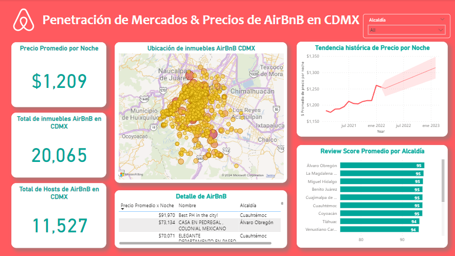

# Penetración de Mercados & Precios de AirBnB en CDMX

## Preguntas de negocio:

¿Cuál es la evolución de las rentas de Airbnb en CDMX?

¿Dónde se incrementa el costo por noche?

¿Existe algún periodo en el tiempo específico donde el promedio por noche se incrementa?

## Insights encontrados:

El precio de las rentas incrementó de 2021 a 2022 en un promedio de 6.68%, representando un incremento menor a la inflación general anual de 7.28% reportada por Gobierno de México.
Con base en estos datos, se pronostica un incremento del 4.28% para 2023.

En las Alcaldías Álvaro Obregón y Cuauhtémoc es donde se encuentran los inmuebles Airbnb con mayor costo en CDMX, con precios entre los 70k - 92k pesos mexicanos por noche.

En la gráfica de tendencia histórica de precio por noche se puede observar un ligero incremento en precios en Julio y Enero. Esto puede corresponder a temporadas altas, debido a vacaciones y festividades.

- Se encontró que la alcaldía Milpa Alta cuenta con las calificaciones más bajas dadas por los huéspedes, mientras que la alcaldía Álvaro Obregón tiene las calificaciones más altas.

- Las calificaciones más bajas están en las alcaldías menos turísticas o céntricas de la CDMX.

- Cada host cuenta con aproximadamente 2 inmuebles en CDMX.

