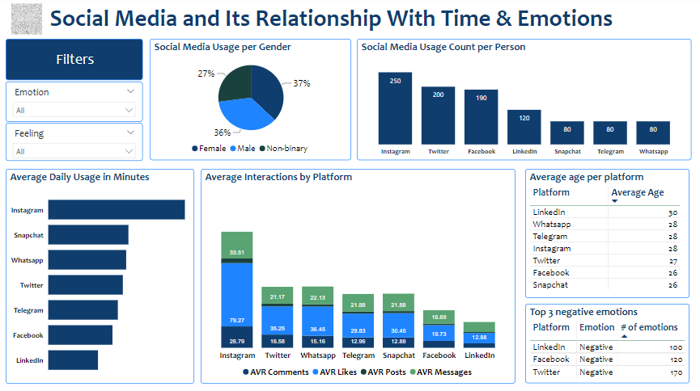

# Social media and its relationship with time and emotions

## Who consumes more social media, men, women, non-binary?

Women tend to use social media more.

## Which platform is used the most?

Instagram is the most used platform with a 25% participation rate, averaging 153.40 minutes of use per day (2.5 hours).

## What are the top 3 social networks that generate the most negative sentiment? Is it related to the time spent there? Is it related to how many times a day they post? Or is it related to interactions, such as likes and comments?

Twitter (170 negative opinions, mainly anger) average age 28, mostly men, is the second most chosen network, and is used on average 83.75 minutes per day (1.39 hours).

Facebook (120 negative opinions, mainly anxiety) average age 26, mostly non-binary, 3rd most chosen network, with an average usage of 71.22 minutes per day (1.2 hours).

LinkedIn (100 negative opinions, mainly boredom) average age 30, mostly men, 4th most chosen network, but least used during the day with an average of 55.83 minutes (0.93 hours).

Facebook and LinkedIn are the least used networks overall, and where the fewest interactions are generated. However, negative feelings are more geared towards anxiety, boredom, and sadness. While Twitter has high usage and interaction, the predominant negative sentiment is anger.

## Which social network is used the most for messaging, and what feelings do these networks generate?

Instagram, led by women, mainly generates positive feelings, followed by negative ones.

# INSIGHTS:

Women prefer to be on social networks that they enjoy, that provoke positive feelings, and where they can interact.

Men tend to use networks that provoke anger and interact there.

Older people are on LinkedIn (which provokes boredom) and younger people prefer WhatsApp and Snapchat (also dominating negative feelings).

Instagram is the most used social network, mainly by women, where more interactions are generated and the sentiment is more inclined towards the positive.

